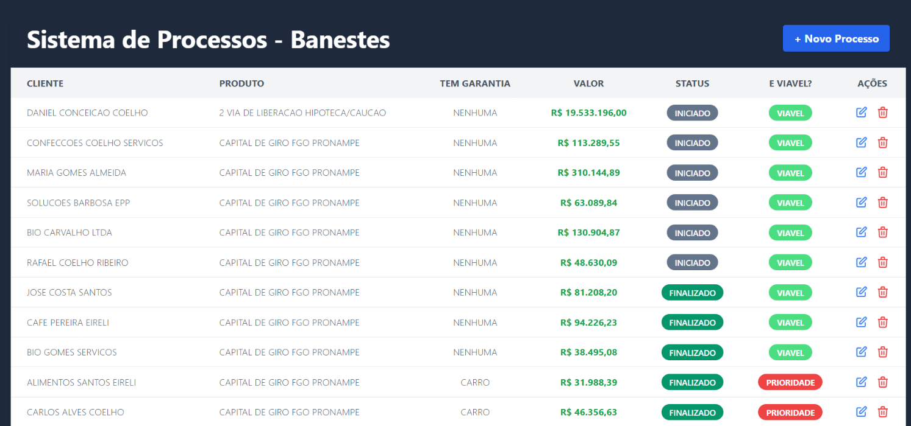

# Sistema de Gerenciamento de Processos - Banestes



## Visão Geral

Este é um sistema web desenvolvido para gerenciar processos de crédito e análise de viabilidade financeira para o Banco Banestes. A aplicação permite cadastrar, editar, consultar e excluir processos de forma intuitiva e organizada, com regras de negócio implementadas para classificação automática de viabilidade.

## Características Principais

### 1. Listagem de Processos
- Tabela visual com todos os processos em tempo real
- Visualização de dados completos: cliente, produto, garantia, valor, status
- Classificação de viabilidade com código de cores
- Status com identificação visual por cores
- Valores formatados em Real (BRL)

### 2. Cadastro de Novos Processos
- Modal intuitivo com validação de campos
- Seleção de produtos e unidades via dropdown
- Geração automática de número de contrato
- Detecção automática de clientes existentes
- Solicitação de CPF/CNPJ para novos clientes
- Registro automático de data e hora

### 3. Edição de Processos
- Carregamento dos dados existentes no formulário
- Alteração de todos os campos relevantes
- Atualização automática de timestamp
- Desabilitação de edição de contrato

### 4. Exclusão de Processos
- Confirmação de segurança antes de deletar
- Remoção imediata da base de dados
- Atualização automática da tabela

### 5. Regra de Viabilidade Automática
A classificação de viabilidade segue a lógica abaixo:
- Valor >= R$15.000 COM garantia: PRIORIDADE (alto interesse)
- Valor >= R$15.000 SEM garantia: VIÁVEL (aprovável)
- Valor < R$15.000: NÃO VIÁVEL (rejeição recomendada)

## Stack Tecnológico

- **Backend**: Google Apps Script (GAS)
- **Frontend**: HTML5 + Tailwind CSS
- **Linguagem Client**: JavaScript Vanilla
- **Banco de Dados**: Google Sheets (Planilha)
- **Arquitetura**: MVC consolidado em Google Apps Script

## Estrutura do Projeto

```
desafio_tecnico_baneste_sap/
├── README.md
└── src/
    ├── Servidor.gs           (Funções de inicialização e renderização)
    ├── acoes.gs              (CRUD e operações principais)
    ├── Consulta.gs           (Busca e processamento de dados)
    ├── Utils.gs              (Funções utilitárias e validações)
    ├── Cliente.html          (Interface principal - layout)
    ├── JS_Formulario.html    (Lógica do formulário de cadastro/edição)
    ├── JS_RenderizarTabela.html (Renderização dinâmica da tabela)
```

## Fluxo de Dados

1. **Carregamento Inicial**: O App Script carrega os dados das abas Processos, Clientes, Produtos e Unidades
2. **Renderização**: Os dados são processados e exibidos na tabela HTML com formatação e cores
3. **Submissão**: Quando o usuário clica em salvar, os dados são enviados via Google Apps Script
4. **Persistência**: Os dados são salvos na planilha Google Sheets
5. **Atualização**: A tabela é atualizada automaticamente com os novos dados

### Operações Básicas

**Visualizar Processos**
- Os processos aparecem automaticamente na tabela ao carregar a página
- Use as cores para identificar rapidamente o status e viabilidade

**Criar Novo Processo**
- Clique no botão "+ Novo Processo"
- Preencha o formulário com os dados do cliente
- Se o cliente não existe, o sistema solicita CPF/CNPJ
- Selecione o produto e unidade
- Insira o valor do contrato e tipo de garantia
- Clique em "Salvar Processo"

**Editar Processo Existente**
- Clique no botão de edição (lápis) na linha do processo
- Altere os dados desejados
- O campo de status fica disponível apenas na edição
- Clique em "Salvar Processo"

**Excluir Processo**
- Clique no botão de exclusão (lixeira) na linha do processo
- Confirme a exclusão no aviso de segurança
- O processo será removido permanentemente

## Regras de Negócio Implementadas

- Números de contrato são sequenciais e únicos
- Clientes são criados automaticamente ao cadastrar com novo nome
- Viabilidade é calculada automaticamente com base em valor e garantia
- Datas de criação e modificação são registradas automaticamente
- Valores monetários são validados e convertidos corretamente

## Validações

- Nome do cliente é obrigatório
- Valor do contrato é obrigatório
- CPF/CNPJ solicitado quando cliente é novo
- Apenas números em campos numéricos
- Formato de moeda aceita pontos e vírgulas

## Melhorias Futuras

- Filtros avançados por cliente, produto, status e período
- Exportação de relatórios em PDF/Excel
- Busca por número de contrato ou cliente
- Paginação de resultados
- Dashboard com indicadores KPI
- Autenticação de usuários com diferentes permissões
- Histórico de alterações em cada processo
- Notificações por email de processos pendentes
- Integração com APIs externas de validação

## Dados Esperados na Planilha

A planilha deve conter as seguintes abas configuradas:

**Aba "Processos"**: Colunas: ID, ID_Cliente, ID_Produto, ID_Unidade, Contrato, Valor, Garantia, Status, Data_Criacao, Data_Atualizacao

**Aba "Clientes"**: Colunas: ID, Nome, CPF_CNPJ

**Aba "Produtos"**: Colunas: ID, Descricao, Nome

**Aba "Unidades"**: Colunas: ID, Descricao, Nome

## Observações Técnicas

- O sistema utiliza Google Apps Script que roda no servidor Google
- Não há necessidade de servidor externo ou configuração complexa
- Os dados são armazenados em Google Sheets, garantindo segurança e disponibilidade
- A interface é responsiva e funciona em desktop e mobile
- Todas as operações utilizam AJAX para melhor experiência do usuário